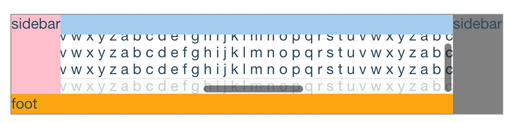

# fixed.react

> React fixed toolbar

[](https://travis-ci.org/fast-flow/fixed.react)
[](https://npmjs.org/package/fixed.react)
[](https://npmjs.org/package/fixed.react)


## Install

```shell
npm install fixed.react --save
```

## Example

[](http://fast-flow.github.io/fixed.react/example)

## Online documentation

[Online](http://fast-flow.github.io/fixed.react)

## Change log

[CHANGELOG](./CHANGELOG.md)
